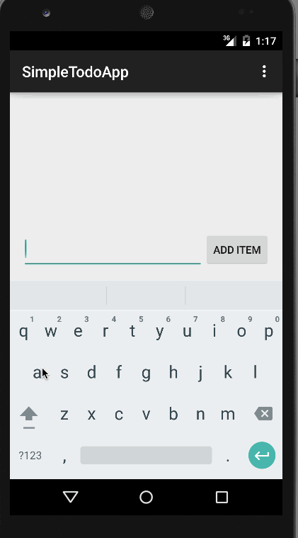

# todoApp

This is a simple todo app which allows you to add, remove, edit, and persist todo items.

* [x] Can you successfully add and remove items from the todo list within your app?
* [x] Did you include support for editing todo items as described above?
* [x] Does your app persist todo items and retrieve them properly on app restart?
* [x] Did you successfully push your code to github? Can you see the code on github?
* [x] Did you add a README which includes a GIF walkthrough of the app's functionality?

